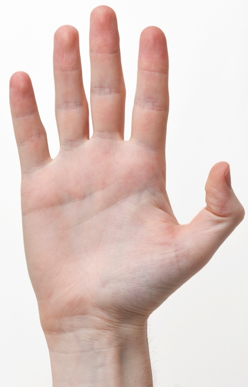
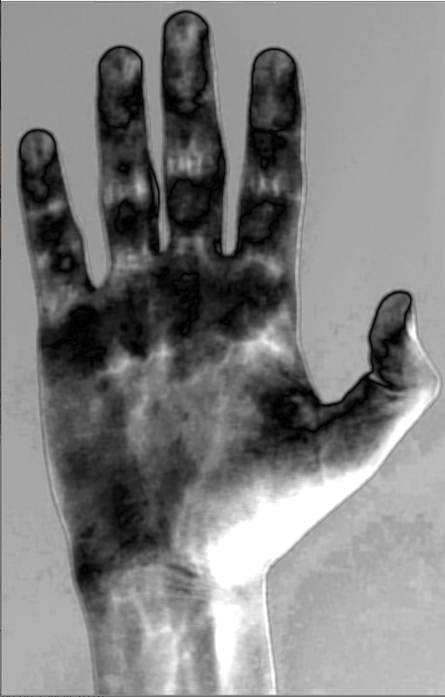
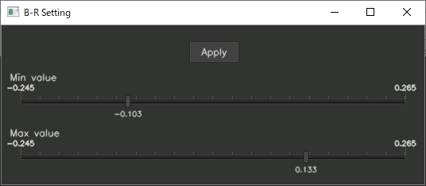
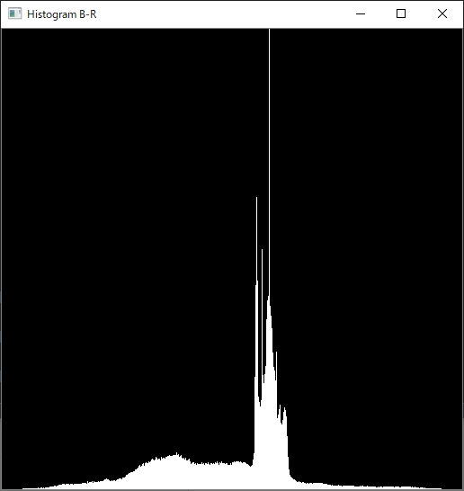

# ImageInformationAnalyzer

## How to build

### Clone repository
```
git clone https://github.com/ice-github/ImageInformationAnalyzer
cd ImageInformationAnalyzer
git submodule init
git submodule update
```

### Prepare install dir
```
mkdir ThirdParty/install
INSTALL_DIR=`pwd`/ThirdParty/install
```

### Build Eigen
```
cd ThirdParty/Eigen
mkdir build && cd build
cmake -DCMAKE_INSTALL_PREFIX=$INSTALL_DIR .. 
make && make install
cd ../../
```
***you should consider removing "build" directory because CMake may refer the build directory as Eigen3 dir**

### Build glog
```
cd ThirdParty/glog
mkdir working && cd working
cmake -DCMAKE_INSTALL_PREFIX=$INSTALL_DIR -DWITH_GFLAGS=false .. 
make && make install
cd ../../
```

### Build ceres-solver
```
cd ThirdParty/ceres-solver
mkdir working && cd working
cmake -DCMAKE_INSTALL_PREFIX=$INSTALL_DIR -DEIGEN_INCLUDE_DIR=$INSTALL_DIR/include/eigen3 -DMINI GLOG=true -DBUILD_EXAMPLES=false -DBUILD_TESTING=false -DGFLAGS=false ..
make && make install
cd ../../
```
***you may encount errors about map/set but the errors can be fixed by adding std::, e.g. std::map**

### Build Project
```
cmake -DOpenCV_DIR=${opencv cmake directory} -DEigen3_DIR=$INSTALL_DIR/share/eigen3/cmake -DCeres_DIR=$INSTALL_DIR/CMake ..
```

***OpenCV_DIR indicates the directory of OpenCVConfig.cmake file. e.g. opencv/build**

## How to run

```
./sample ${Project directory}/img/Hand.jpg
```
***you can change the luminance by using the setting window and "Apply" button**



* https://ja.m.wikipedia.org/wiki/%E3%83%95%E3%82%A1%E3%82%A4%E3%83%AB:Human-Hands-Front-Back.jpg





